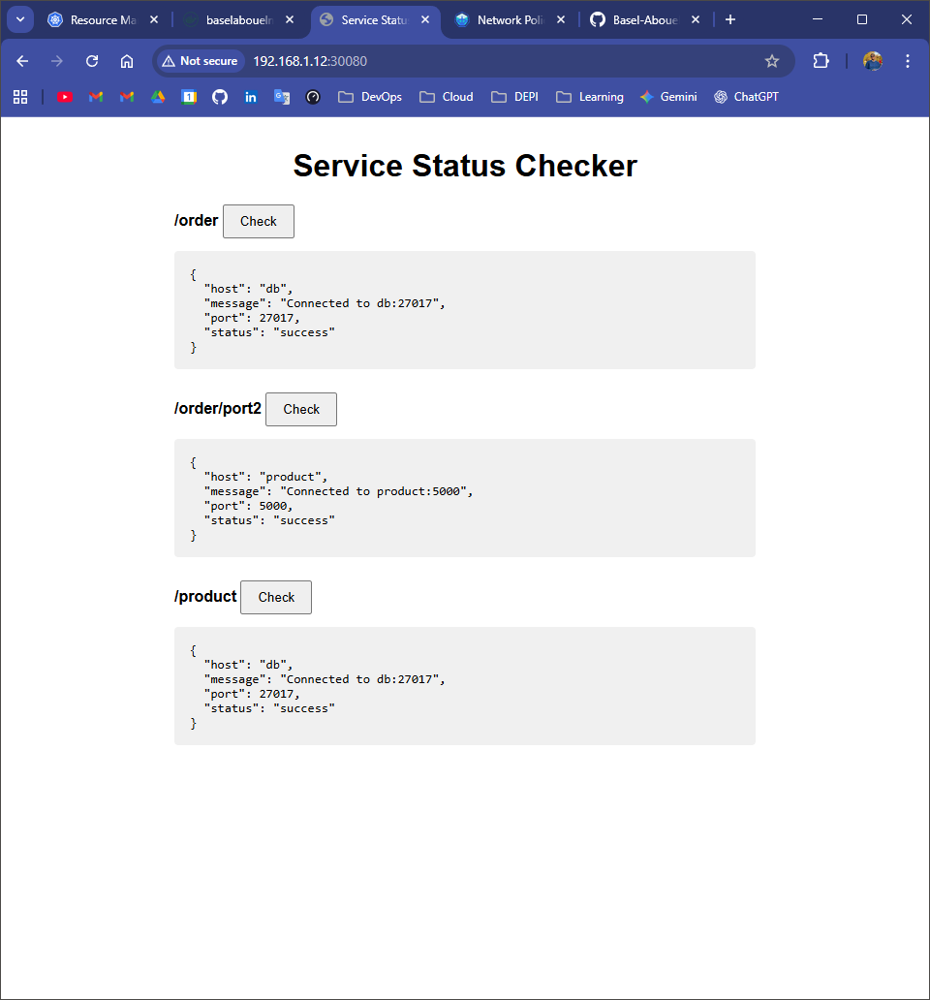
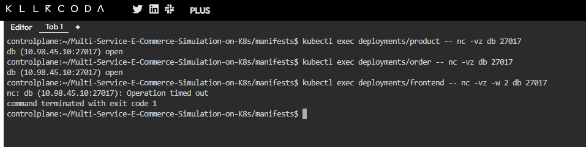

# Multi-Service-E-Commerce-Simulation-on-K8s
This is a deployment of a 3 tier e-commerce application (simulation) on a kubernetes cluster.

## Architecture Diagram 
```
[ Browser ] → (NodePort) → [ Frontend ] → (ClusterIP) → [ Product Service ]
                                        ↘ (ClusterIP) → [ Order Service ] → (ClusterIP) → [ DB ]
```
### The project contains the following containerized components:-
- Database (MongoDB): internal only.
- Product Service ([Backend](app/Dockerfile)): ClusterIP, talks to DB.
- Order Service ([Backend](app/Dockerfile)): ClusterIP, talks to DB, Product Service.
- Frontend ([Nginx](nginx/Dockerfile)): NodePort, talks to Product, Order services.
-  NetworkPolicies to secure communication.
> Note: The backend here referes to a simple flask application that test connection to the specified `host:port` and returns the resutls in json format to be displayed on the frontend tier.
<br>
<hr>

## Deploying the application
1. First you need to close this repository
    ```bash
    git clone https://github.com/Basel-Abouelnour/Multi-Service-E-Commerce-Simulation-on-K8s.git
    ```
2. Then you need to install [Calico](https://docs.tigera.io/calico/latest/getting-started/kubernetes/self-managed-onprem/onpremises#install-calico) as the network plugin needed to apply the network policies. (Optional)
    > Note: If you're working on a minikube invironment you may face some issues getting the CNI to work as needed.<br> 
3. Then change directory into the [manifests](manifests/) directory create resources.
    ```bash
    cd manifests
    kubectl apply -f .
    ```
4. Wait for all resources to be ready then access the frontend on port 
`30080`.  From the browser you can make sure that the backend components can communicate with eachother, and with the database.


5. To test the network policy you can exec the followin command on the frontend deployment to make sure that the policy is enforced.
    ```bash
    kubectl exec deployment/frontend -- nc -zv -w 2 db 27017
    ```
    If you install supporting CNI the netwwork policy should work and the command will exit with code 1 
    